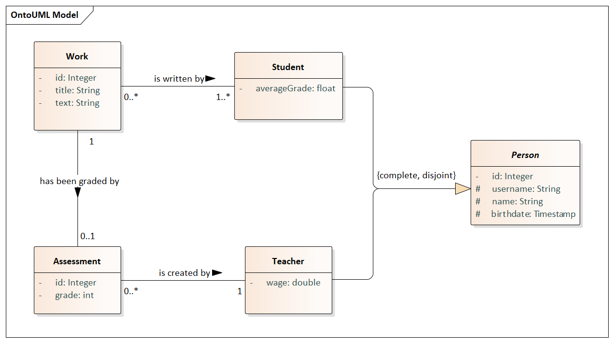

# TJV sem

## Domain Model

## Quick Start Guide

### Execute following steps, if using linux terminal:

- Navigate to the root directory of the project
- Switch to branch `kb3` or later
- Execute `build-project.sh`
- To run server execute `run-server.sh`

### Execute following steps, if using explorer:

- Open the root directory of the project
- Switch to branch `kb3` or later using any git client (e.g. GitKraken)
- Execute `build-project.sh`
- Execute `run-server.sh`

### Alternatively you can start IntellijIDEA and:

- Switch to branch `kb3` or later in VCS settings of the directory
- Run gradle task `Install` on `model` project at subdirectory `modules/model`
- Run gradle task `Install` on `entity` module at subdirectory `modules/entity` from root project (tried out what's the difference between module and subproject)
- Run `ServerApp` in project `server` at subdirectory `modules/server`

### Alternatively you can directly use commands from shell scripts:

#### Build project:

- `./gradlew init`
- `./gradlew init -p modules/model`
- `./gradlew init -p modules/server`
- `./gradlew init -p modules/client`
- `./gradlew install -p modules/model`
- `./gradlew install -p modules/entity`
- `./gradlew build -x test -p modules/server`
- `./gradlew build -p modules/client`

#### Run server:

- `java -jar modules/server/build/libs/server-0.1-SNAPSHOT.jar` 

## Server

Server uses CTU FIT's OracleDB connection, so where is no need to configure anything db related, it should work just fine out of the box (hope so).

## Client

To run client run command `java -jar modules/client/build/libs/client-0.1-SNAPSHOT.jar` with wanted arguments as listed in `Client` section below

Or

Start IntellijIDEA and run `ClientApp` in project `client` at subdirectory `modules/client` and give it appropriate arguments as listed in `Client` section below

Client provides both executing arguments from command line and environment inside client. So you can:

- Run client with `java -jar modules/client/build/libs/client-0.1-SNAPSHOT.jar --entity=student --action=readAll`, which will give you the result on start-up and client will when wait for other commands

- Run client without any arguments and then execute `--entity=student --action=readAll` from the inside and client will when wait for other commands

If you want only to run client from the command line just use `exit` argument at the end, like this: `java -jar ... --entity=student --action=readAll exit`

This implies, that you can pass pre-written scripts, for example `resources/clientScript.txt`, to the client using `java -jar ...SNAPSHOT.jar < resources/clientScript.txt` 

### Basic commands:

To get help type in:

- `help`
- `h`
- `manual`
- `man`

To get current time type in:

- `date`
- `time`

To exit type in:

- `exit`
- `quit`
- `q`

### Basic actions:

- `--action=create ...`
- `--action=read id=<id>`
- `--action=update id=<id> ...`
- `--action=delete id=<id>`
- `--action=readAll`
- `--action=pageAll`

### Arguments for actions:

- Use `--entity=<wanted-entity>` to operate with entity of type `<wanted-entity>`
- Use `--valueAttribute=<value>` to pass simple attribute (e.g. Integer, String etc.), notice, that only the first value passed will be taken unlike the complex attribute
- Use `--complexAttribute=<value1> --complexAttribute=<value2> ...` to pass multiple attributes as complex attribute (i.e. authorIds for Work entity etc.)

### Attributes info:

- `*` means required for creation, does not mean it always contains some value
- `(optional)` means non-required for creation
- `(comlex)` means this attribute can store multiple values at once

### Available options per entity:

#### Student:

Use `--entity=student`

Student's attributes:

- `--username` *
- `--name` *
- `--birthdate` (optional)
- `--averageGrade` (optional)
- `--workIds` (optional, complex)

Special actions:

- `--action=readByUsername username=<username>`
- `--action=readAllByName name=<name>`
- `--action=joinWork studentId=<id1> workId=<id2>`

#### Teacher:

Use `--entity=teacher`

Teacher's attributes:

- `--username` *
- `--name` *
- `--birthdate` (optional)
- `--wage` (optional)
- `--assessmentIds` (optional, complex)

Special actions:

- `--action=readByUsername username=<username>`
- `--action=readAllByName name=<name>`

#### Work:

Use `--entity=work`

Work's attributes:

- `--title` *
- `--text` (optional)
- `--authorIds` * (complex)
- `--assessmentId` (optional)

Special actions:

- `--action=readAllByTitle title=<title>`

#### Assessment:

Use `--entity=assessment`

Assessment's attributes:

- `--grade` *
- `--workId` *
- `--evaluatorId` *

Special actions:

- `--action=readAllByEvaluatorId evaluatorId=<evaluatorId>`

## Problem Solving

If server application is throwing an error, that wanted port is already in use:

- At `server` project files at `src/main/resources/application.properties` change value `server.port = 8080` to `8081` or any other port number, compliant to your system port notation.
- Do not forget to change `client`'s `application.properties` accordingly, the file is located similarly.

All logs with severity less than `warn` were disabled for `client`. To change that see `application.properties` at `client` module.